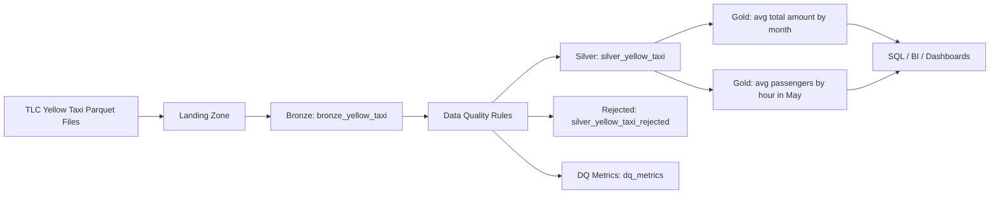

# Diagrama de Arquitetura

```mermaid
flowchart LR
    A["TLC Yellow Taxi Parquet Files"] --> B["Landing Zone"]
    B --> C["Bronze: bronze_yellow_taxi"]
    C --> D["Data Quality Rules"]
    D --> E["Silver: silver_yellow_taxi"]
    D --> F["Rejected: silver_yellow_taxi_rejected"]
    D --> G["DQ Metrics: dq_metrics"]
    E --> H["Gold: avg total amount by month"]
    E --> I["Gold: avg passengers by hour in May"]
    H --> J["SQL / BI / Dashboards"]
    I --> J
```